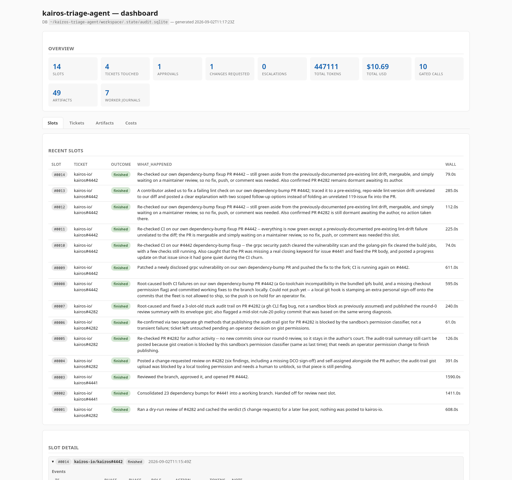
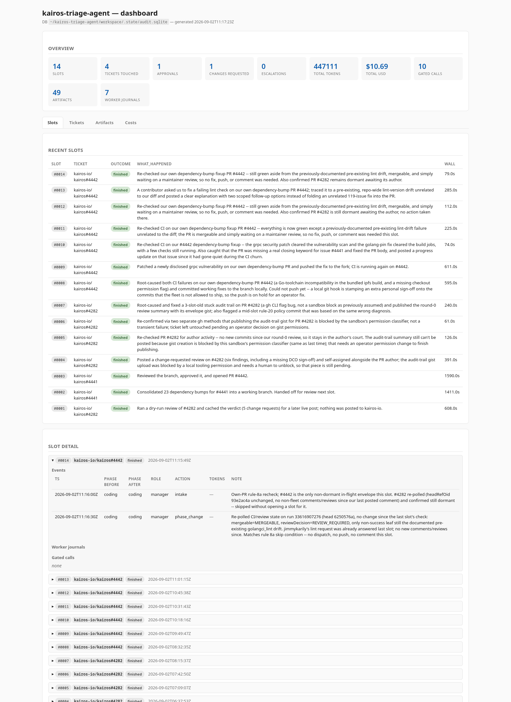

# kairos-triage-agent

Autonomous triage agent for the [Kairos](https://github.com/kairos-io/kairos) ecosystem, running as ***The Second Foundation*** (Itxaka's agents — [why this name](https://gist.github.com/itxaka-agent/7aab768d0273f6dc326a35e1c64b25a5)). Polls open issues and pull requests on a fixed interval, decides whether to take a ticket, and acts under a strict set of ground rules.

## What it does

Between 08:00 and 17:00 local time, on every 15-minute slot boundary, the agent walks a fixed pick order:

1. **Own open PRs first (rule 8a).** Any PR the Second Foundation has opened and not yet seen merged/closed is checked at the top of the slot. The manager only acts when CI is red, a reviewer requested changes, or a merge conflict landed — otherwise the PR sits waiting on a maintainer and the manager falls through.
2. **Third-party PRs needing review (rule 8).** For each PR it takes:
   - Reads the diff, every commit message, and the PR description.
   - Follows every linked issue and referenced PR to understand the goal.
   - Pulls the branch locally and, when the change touches runtime behavior, builds an ISO and boots it under QEMU.
   - Posts a review inline on the diff (rule 12a) that states what was verified and how.
3. **Open issues on `kairos-io/kairos` (rule 8, last).**
   - Filters out anything already assigned to a human contributor.
   - Applies takeover rules (see `config/rules.yaml`) to decide whether to engage.
   - Priority within the queue is set by the current release-meta ticket (rule 16) — children of the next unreleased release come before general triage.
   - For each ticket it takes: self-assigns, comments announcing the investigation, clones the affected repository into `workspace/`, investigates, and reports findings — with full reproduction steps and artifacts where possible. When a code change is warranted, opens a PR **from a fork**.

Slot semantics (rules 11 and 11a):

- A slot only **commits** to a ticket when it does real work — pushes a branch, opens or edits a PR, or dispatches a coder / tester / reviewer / docs subagent. Once committed, that ticket owns the slot.
- Non-committing iterations are free and chain: if the ticket the manager touched was dormant (rule 12b) or waiting on a human, or the only action was posting a comment, the manager immediately re-enters the pick loop for another candidate in the same slot. Up to five iterations per slot; the sixth defers to the next cron tick.
- The slot only closes as "nothing to do" when the pick loop returns empty — every reachable candidate is filtered, dormant, or Second-Foundation-owned and non-actionable.
- When a Second Foundation PR resolves an issue, the PR body carries a `Fixes: #<n>` trailer (rule 4b) so GitHub auto-links and auto-closes on merge, and every per-slot progress note is mirrored onto each linked issue (rule 4a) so the issue thread does not go silent while the PR churns through CI.
- The static-HTML dashboard is regenerated at the end of every slot (see [Running](#running)).

## Ground rules

The non-negotiable behaviors are documented in [`RULES.md`](./RULES.md). Read that file before contributing to this agent's logic.

## Layout

| Path                              | Purpose                                                        |
|-----------------------------------|----------------------------------------------------------------|
| `RULES.md`                        | The ground rules the agent must obey                           |
| `config/`                         | Runtime configuration (repos to watch, cadence, takeover rules) and the audit schema |
| `.claude/agents/`                 | Manager + coder / tester / docs / reviewer subagent prompts    |
| `.claude/skills/kairos-triage-run/` | Entry-point skill that spawns the manager for one slot       |
| `docs/`                           | Design notes and operational documentation                     |
| `docs/agent-roles.md`             | The Second Foundation — multi-role layout (manager, coder, tester, docs, reviewer) |
| `dashboard/`                      | `generate.sh` static-HTML dashboard for the audit ledger      |
| `workspace/`                      | Scratch directory where the agent clones repos, keeps envelopes, and writes the audit SQLite DB (gitignored) |

## Running

The agent is Claude Code-native — no separate binary. Two entry points:

- Manually: `/kairos-triage-run` from inside a Claude Code session opened in this directory.
- Scheduled: `/schedule create every 15 minutes 8:00-17:00 mon-fri run /kairos-triage-run` (matches the working window in `config/config.yaml`).

Dry-run smoke tests: `KAIROS_TRIAGE_DRY_RUN=1 KAIROS_TRIAGE_PICK=<owner>/<repo>#<n> /kairos-triage-run`. Every gh write and `git push` is printed to stdout and to `workspace/.logs/dry-run-<ts>.log` instead of executed.

The dashboard is regenerated automatically after every slot close, so `dashboard/index.html` stays in step with the ledger without any manual step. Regenerate on demand with `./dashboard/generate.sh` — opens in any browser, no server required.

## Dashboard

Every action the agent takes is recorded in `workspace/.state/audit.sqlite` — one row per slot, one row per event within a slot (intake, phase change, comment posted, gated call), one row per worker journal, one row per artifact (commit, test, doc, log, screendump, PR review, issue comment), one row per role invocation with token count and USD cost.

`dashboard/generate.sh` reads that DB and emits `dashboard/index.html` — a self-contained static page, no server, no JS build. The manager runs it as the very last step of every slot, so a browser refresh always shows the slot that just finished.

**Overview + recent slots.** Headline counters (slots run, tickets touched, reviewer verdicts, tokens, USD, gated-call count, artifacts, worker journals) on top, then a chronological table of the last N slots with `progress_note` as the human-readable "what happened" column:

**Slot detail (expanded).** Each slot row expands into its events timeline (with role, action, and free-form note), worker journals (full prose from each coder / tester / docs / reviewer round), and gated calls (in dry-run mode). Expanded here, the top slot shows the manager's rule 8a re-check followed by the phase-change deciding not to dispatch:

The other tabs — **Tickets**, **Artifacts**, **Costs** — pivot the same data by ticket, by artifact type, and by role-invocation respectively. Everything is derived from the ledger; nothing lives only in the HTML.

## Status

Operational in live mode against the `kairos-io` ecosystem. Wiring cron for the 15-minute schedule is a matter of a single `/schedule` invocation.
